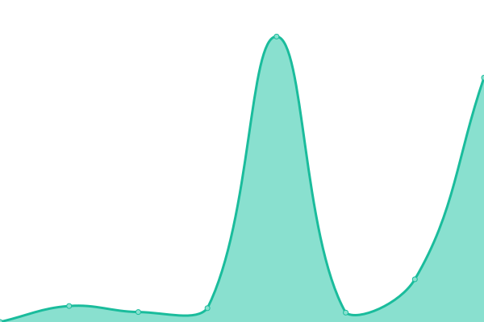

# [📈 Live Status](https://iamthecloverly.github.io/monitor): <!--live status--> **🟩 All systems operational**

This repository contains the open-source uptime monitor and status page for [SriBalaji](https://sribalaji.eu.org), powered by [Upptime](https://github.com/upptime/upptime).

With [Upptime](https://upptime.js.org), you can get your own unlimited and free uptime monitor and status page, powered entirely by a GitHub repository. We use [Issues](https://github.com/iamthecloverly/monitor/issues) as incident reports, [Actions](https://github.com/iamthecloverly/monitor/actions) as uptime monitors, and [Pages](https://iamthecloverly.github.io/monitor) for the status page.

<!--start: status pages-->
<!-- This summary is generated by Upptime (https://github.com/upptime/upptime) -->
<!-- Do not edit this manually, your changes will be overwritten -->
<!-- prettier-ignore -->
| URL | Status | History | Response Time | Uptime |
| --- | ------ | ------- | ------------- | ------ |
|  [Sribalaji](https://www.sribalaji.eu.org) | 🟩 Up | [sribalaji.yml](https://github.com/iamthecloverly/monitor/commits/HEAD/history/sribalaji.yml) | 

 253ms
     
 | 

<a href="https://status.sribalaji.eu.org/history/sribalaji">100.00%</a>
    

|  [Techviz](https://vsb.techviz.tech) | 🟩 Up | [techviz.yml](https://github.com/iamthecloverly/monitor/commits/HEAD/history/techviz.yml) | 

 100ms
     
 | 

<a href="https://status.sribalaji.eu.org/history/techviz">100.00%</a>
    

|  [Hacker News](https://news.ycombinator.com) | 🟩 Up | [hacker-news.yml](https://github.com/iamthecloverly/monitor/commits/HEAD/history/hacker-news.yml) | 

 234ms
     
 | 

<a href="https://status.sribalaji.eu.org/history/hacker-news">99.78%</a>
    

|  [Drive](https://cloud.sribalaji.eu.org) | 🟩 Up | [drive.yml](https://github.com/iamthecloverly/monitor/commits/HEAD/history/drive.yml) | 

 5095ms
     
 | 

<a href="https://status.sribalaji.eu.org/history/drive">100.00%</a>
    

|  [Portfolio](https://portfolio.sribalaji.eu.org) | 🟩 Up | [portfolio.yml](https://github.com/iamthecloverly/monitor/commits/HEAD/history/portfolio.yml) | 

 205ms
     
 | 

<a href="https://status.sribalaji.eu.org/history/portfolio">100.00%</a>
    

<!--end: status pages-->

[**Visit our status website →**](https://iamthecloverly.github.io/monitor)

## 📄 License

- Powered by: [Upptime](https://github.com/upptime/upptime)
- Code: [MIT](./LICENSE) © [SriBalaji](https://sribalaji.eu.org)
- Data in the `./history` directory: [Open Database License](https://opendatacommons.org/licenses/odbl/1-0/)
